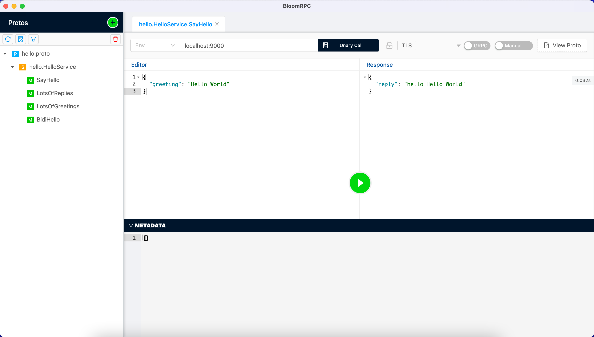

# Evans Python Wrapper
This is a Python wrapper for the Evans CLI. It is a work in progress and is not yet complete.
I created this because I previously use bloom rpc and I want a scripted version of it.

## Installation
Create python virtual environment and install dependencies:
```bash
python3 -m venv venv
source venv/bin/activate
pip install -r requirements.txt
```

Install Evans CLI:
*detail can be seen here https://github.com/ktr0731/evans#installation

```bash
go get github.com/ktr0731/evans
```

or using brew
```bash
brew tap ktr0731/evans
brew install evans
```

## [Optional] Run local grpcbin server
```bash
docker run -it --rm -p 9000:9000 -p 9001:9001 moul/grpcbin
```


## Sample Usage
```python
from evans_wrapper import EvansWrapper

wrapper = EvansWrapper()
result, error = wrapper.call(
    proto_file="./sample_proto/hello.proto",
    endpoint="hello.HelloService.SayHello",
    host_port="localhost:9000",
    payload={
        "greeting": "Hello World",
    },
    metadata={},
    tls=False
)

print(result)
print(error)
print(wrapper.get_enrich())
```

This is analogous to the following bloom screenshot:


